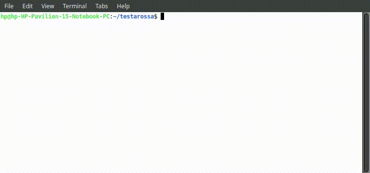

# Testarossa CLI

A command-line tool to automatically generate test files for Go source code.

# Requirements

- Environment variable `GEMINI_KEY` set to a valid Gemini API key. Get one [here](https://aistudio.google.com/apikey).
- Go 1.24.2 and up

# Install
Run the following command to install:

    go install github.com/cheikh2shift/testarossa/cmd/test-gen@latest

---

### Usage

```bash
test-gen [flags] <custom prompt>
```

---

### Flags

| Flag           | Type   | Default       | Description                                                                               |
| -------------- | ------ | ------------- | ----------------------------------------------------------------------------------------- |
| `-extension`   | string | `" .go"`      | File extension to scan for source files. Specify if your code uses a different extension. |
| `-file`        | string | `"./file.go"` | Path to the single Go source file to generate tests for.                                  |
| `-output`      | string | `"test.go"`   | Destination path (including filename) where the generated test code will be written.      |
| `-projectroot` | string | `"./"`        | Root directory of your project. Used to resolve import paths and module structure.        |

---

### Examples

* **Generate tests for a single file**

  ```bash
  test-gen -file ./handlers/user.go -output ./handlers/user_test.go
  ```

* **Scan non-standard extension**

  ```bash
  test-gen -extension ".gox" -file ./cmd/main.gox -output ./cmd/main_test.gox
  ```

* **Specify a custom project root**

  ```bash
  test-gen -projectroot ../my-go-project -output services/payments_test.go -file services/payments.go
  ```

* **Generate REST API documentation**

  ```bash
  test-gen -projectroot ../my-go-project -output ./documentation.md -file handlers/mux.go "Generate REST API documentation for the following code" 
  ```

---

### Notes

* By default, `test-gen` looks for files ending in `.go` under the current directory.
* Ensure the `-projectroot` reflects the module root so imports and package paths are resolved correctly.
* Output files will be overwritten if they already exist—back them up if necessary.

Demo:


