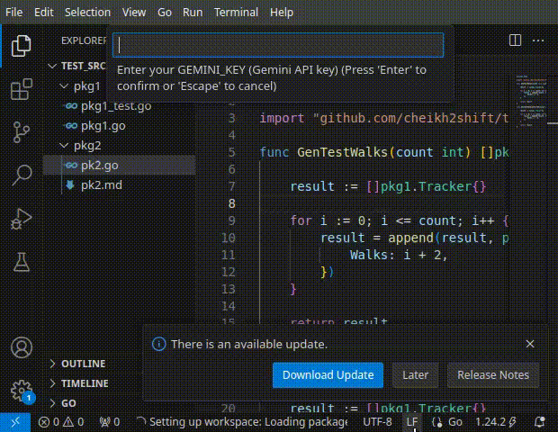

# Testarossa

A VS code plugin that automatically generates test files for Go source code.

# Usage

- Right click on the file you wish to generate tests for and click on "Generate Tests" in the context menu.

# Demo

